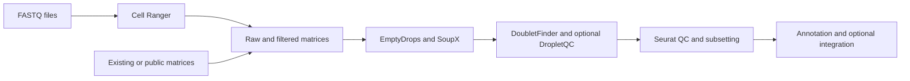

# Ewing Sarcoma Single-Cell RNA-seq Analysis

R, Python and Bash workflows for quality control, cell-type annotation and integration of Ewing sarcoma single-cell RNA-seq data.

The pipeline identifies cell-containing droplets, corrects ambient RNA contamination, detects doublets and produces annotated Seurat objects for comparing cell populations across samples.

**Author:** [Angelina Yershova](https://github.com/itismeangie) · [LinkedIn](https://www.linkedin.com/in/angelina-yershova/)

## Workflow

| Stage | Implementation | Purpose |
|---|---|---|
| FASTQ processing (optional) | Cell Ranger | Generate gene-by-barcode count matrices |
| Droplet QC | EmptyDrops; optional BAM-dependent DropletQC | Assess droplets and damaged-cell signals |
| Ambient RNA correction | SoupX | Estimate and correct background RNA contamination |
| Doublet detection | DoubletFinder | Flag likely multiplets before downstream analysis |
| Annotation | Seurat, marker scoring, AUCell and optional Azimuth references | Support cell-type and Ewing-associated state interpretation |
| Integration | Seurat | Produce merged and optionally integrated objects |



## Inputs

- Start from FASTQs, existing Cell Ranger outputs, or compatible public count matrices.
- EmptyDrops and SoupX require **both raw and filtered** gene-by-barcode matrices for each sample.
- DropletQC requires a compatible BAM and index. For matrix-only inputs, set `SEURAT_FINAL_REQUIRE_DROPLETQC=false` in the local configuration.
- `bin/prepare_geo_primary.sh` downloads and prepares GEO **GSE277083** and its primary-sample metadata.
- Install Cell Ranger separately and download the reference genome, input datasets and any annotation references needed for the analysis.


## Quick Install (recommended)
1. Clone the repo:
```bash
git clone https://github.com/ewing-sarcoma-fightclub/scRNAseq_qc_annotation.git
cd scRNAseq_qc_annotation
```
2. Install `micromamba` (or `mamba`/`conda`), then run:
```bash
./bin/setup_envs.sh
```
This will:
- Create/update Python and R environments
- Install required R packages in the correct order
- Write `env/config.local.env` with pinned `R_BIN`/`PYTHON_BIN`
- Pin `R_LIBS_USER=NULL` so pipeline runs use the env library, not user-level R libs

3. Edit config (`setup_envs.sh` already creates `env/config.local.env`):
```bash
[[ -f env/config.local.env ]] || cp env/config.env env/config.local.env
```
Set at minimum:
- `FASTQ_ROOT` (if using FASTQs)
- `AMBIQUANT_REPO` (optional, for ambient contamination tracking)
- `SEURAT_FINAL_REQUIRE_DROPLETQC=false` (if no BAM files)

4. Run pipeline:
```bash
./bin/run_all.sh
```

Matrix-only input (no FASTQs, no BAM):
```bash
# Use the Python environment created above; the helper needs pandas and numpy.
micromamba run -n ewing-scrna-py bash ./bin/prepare_geo_primary.sh
# First set SEURAT_FINAL_REQUIRE_DROPLETQC=false in env/config.local.env.
./bin/run_all.sh --skip-cellranger --cellranger-root ./outputs/cellranger --qc-out ./outputs/qc --config ./env/config.local.env
```

The preparation command downloads GSE277083. Its optional `--clean` flag deletes and rebuilds the selected output directory. Replace `micromamba` with `mamba` or `conda` if needed.

## R Dependency Order
R dependencies are installed by `r/install_pipeline_packages.R` in this order:
1. CRAN baseline: `future`, `mclust`, `remotes`, `statmod`
2. Bioconductor: `AUCell`, `DropletUtils`
3. CRAN stack needed by DropletQC on some systems: `nloptr`, `lme4`, `pbkrtest`, `car`, `rstatix`, `ggpubr`
4. GitHub-only required packages:
   - `chris-mcginnis-ucsf/DoubletFinder`
   - `powellgenomicslab/DropletQC`
5. Optional Azimuth references via `SeuratData::InstallData()`

The installer is idempotent and ends with a required-package verification table.

## Manual Environment Setup (if not using `setup_envs.sh`)
### Linux
```bash
micromamba create -n ewing-scrna-py -f env/envs/python.lock.yml
micromamba create -n ewing-scrna-r  -f env/envs/r.lock.yml
micromamba run -n ewing-scrna-r env -u R_LIBS R_LIBS_USER=NULL Rscript r/install_pipeline_packages.R
```

### macOS (Apple Silicon)
```bash
micromamba create -n ewing-scrna-py -f env/envs/python.yml
micromamba create -n ewing-scrna-r  -f env/envs/r.macos.yml
micromamba run -n ewing-scrna-r env -u R_LIBS R_LIBS_USER=NULL Rscript r/install_pipeline_packages.R
```

### macOS (Intel)
```bash
micromamba create -n ewing-scrna-py -f env/envs/python.yml
micromamba create -n ewing-scrna-r  -f env/envs/r.yml
micromamba run -n ewing-scrna-r env -u R_LIBS R_LIBS_USER=NULL Rscript r/install_pipeline_packages.R
```

If Bioconductor builds fail on macOS with compiler errors:
```bash
xcode-select --install
```
Then set `~/.R/Makevars`:
```make
CC=clang
CXX=clang++
CC17=clang
CXX17=clang++
```

## Optional Azimuth Reference Preload
```bash
./bin/setup_envs.sh --install-azimuth-refs --azimuth-refs lungref,liverref
```

## Quick Start Commands
Run full pipeline (Cell Ranger + QC):
```bash
./bin/run_all.sh
```

Run QC only from existing Cell Ranger outputs:
```bash
./bin/run_all.sh --skip-cellranger --cellranger-root /path/to/cellranger_out --qc-out ./outputs/qc --config ./env/config.local.env
```

Run QC entrypoint directly:
```bash
./bin/pipeline_QC_after_cellranger.sh --root /path/to/cellranger_out --out ./outputs/qc --config ./env/config.local.env
```

## Output Layout
- `outputs/refdata/` Cell Ranger reference
- `outputs/cellranger/` Cell Ranger per-sample outputs
- `outputs/qc/` QC outputs (EmptyDrops, SoupX, DoubletFinder, DropletQC, Seurat QC, optional AmbiQuant)
- `outputs/annotation_integration/` merged annotation/integration outputs

## Repo Layout
- `bin/` orchestration and setup scripts
- `scripts/` per-tool loop wrappers
- `r/` R analysis/install scripts
- `python/` Python utilities
- `resources/` static resources and marker tables
- `env/` env definitions and config templates

## Notes
- Cell Ranger is proprietary and must be installed separately.
- `env/config.local.env` is preferred over `env/config.env`.
- If `AMBIQUANT_REPO` is empty, AmbiQuant steps are skipped.

## Tests

The tests check configuration passed to analysis processes, resume behavior and environment setup with paths containing spaces. They use temporary files and stand-ins for Rscript and micromamba, so they run without sequencing data or R packages:

```bash
python3 -m unittest discover -s tests -v
```

## Analysis settings

- Set QC thresholds, annotation references, doublet parameters and integration options in `env/config.local.env` for each dataset.
- Check cell-type assignments against marker expression.
- Use a fresh output directory when changing analysis settings; resume mode reuses existing files.
- Record package and reference versions with each run. Linux environment exports and macOS environment definitions are included; R packages installed from GitHub use the available version at installation time.

Downloaded inputs, generated outputs and local configuration are excluded from version control by `.gitignore`.

## Related work

- [Automated colony formation assay image analysis](https://github.com/ewing-sarcoma-fightclub/analyse-CFA-automatically): Python image quantification with visual QC.
- [SF3B4 and chromosome 1q gain](https://github.com/itismeangie/SF3B4-as-1q-gain-driver): cancer-genomics analysis workflows.

## License

Repository code is provided under the [MIT License](LICENSE). External datasets, reference annotations and third-party tools retain their own terms.
